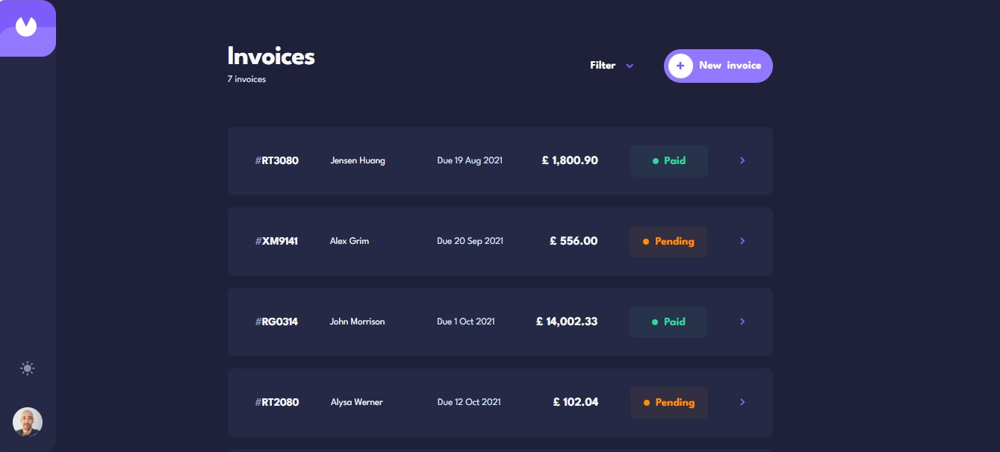

# Frontend Mentor - Invoice app

# Frontend Mentor - Invoice app solution

This is a solution to the [Invoice app challenge on Frontend Mentor](https://www.frontendmentor.io/challenges/invoice-app-i7KaLTQjl). Frontend Mentor challenges help you improve your coding skills by building realistic projects. 

## Table of contents

- [Overview](#overview)
  - [The challenge](#the-challenge)
  - [Screenshot](#screenshot)
  - [Links](#links)
- [My process](#my-process)
  - [Built with](#built-with)
- [Author](#author)

## Overview

### The challenge

Users should be able to:

- View the optimal layout for the app depending on their device's screen size ✅
- See hover states for all interactive elements on the page ✅
- Create, read, update, and delete invoices ✅
- Receive form validations when trying to create/edit an invoice ✅
- Save draft invoices, and mark pending invoices as paid ✅
- Filter invoices by status (draft/pending/paid) ✅
- Toggle light and dark mode ✅

### Screenshot

### Links

- Solution URL: [Link](https://www.frontendmentor.io/solutions/invoice-app-built-with-angular-angular-material-EbYGUuqOBf)
- Live Site URL: [Link](https://invoice-app-pi-ecru.vercel.app/invoices)

## My process

### Built with

- Angular
- Reactive Forms
- TypeScript
- SASS
- Ngx Mask
- RxJS

## Author

- Frontend Mentor - [@danielmrz-dev](https://www.frontendmentor.io/profile/danielmrz-dev)
- LinkedIn - [@danielmrz-dev](https://www.linkedin.com/in/danielmrz-dev/)